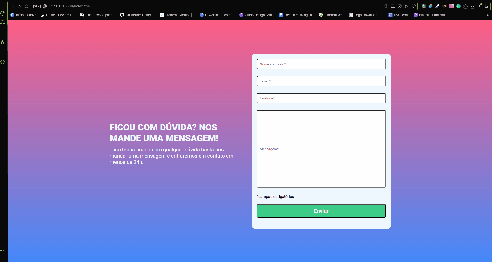
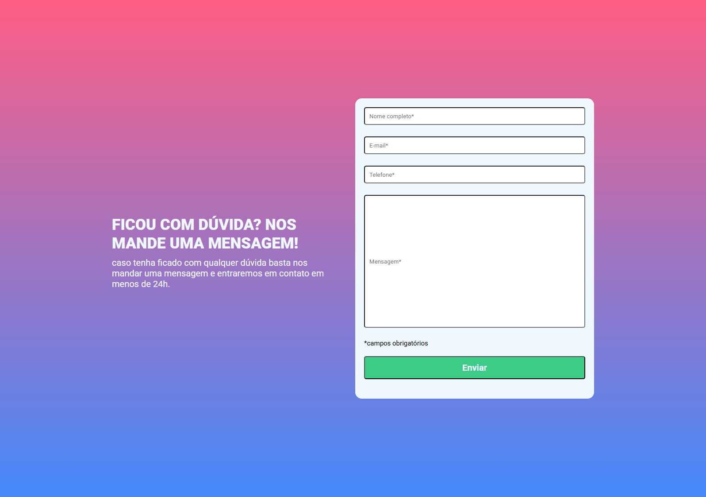
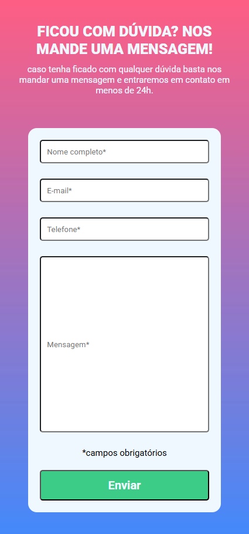
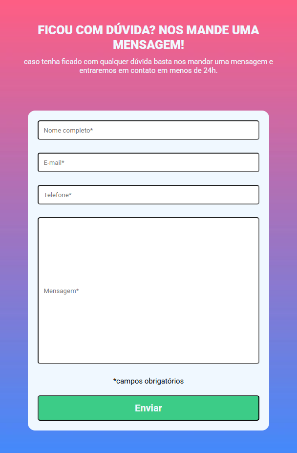

# 📋 Formulário Responsivo com Validação em JavaScript

Um formulário de contato moderno, responsivo e validado com **JavaScript puro**.  
O projeto valida campos obrigatórios (nome, e-mail, telefone e mensagem), destaca erros em tempo real e só permite envio quando todos os campos estão corretos ✅.

---

## 🛠️ Tecnologias Utilizadas

-   
-   
-   

---

## 🚀 Demonstração

### 🎥 Funcionamento do formulário


### 🖥️ Versão Desktop


### 📱 Versão Mobile


### 📲 Versão Tablet


---


## 📂 Estrutura do Projeto

```bash
📁 PROJETO-FORMULARIO
 ┣ 📂 src
 ┃ ┣ 📂 css
 ┃ ┃ ┣ 📜 reset.css         # Reset de estilos
 ┃ ┃ ┣ 📜 responsive.css    # Estilos para responsividade
 ┃ ┃ ┗ 📜 style.css         # Estilo principal do formulário
 ┃ ┣ 📂 design
 ┃ ┃ ┗ 🖼️ divisão.jpg       # Elemento gráfico do design
 ┃ ┣ 📂 img
 ┃ ┃ ┣ 🖼️ bg-repeat.jpg     # Imagem de fundo repetida
 ┃ ┃ ┣ 🎞️ formulario.gif    # Demonstração do formulário
 ┃ ┃ ┣ 🖼️ iPad-mini-608x926.png
 ┃ ┃ ┣ 🖼️ iPhone-13-Pro-Max-425x909.png
 ┃ ┃ ┗ 🖼️ Macbook-Air-1596x1122.png
 ┃ ┗ 📂 js
 ┃   ┗ 📜 index.js          # Lógica de validação do formulário
 ┣ 📜 index.html            # Estrutura da página
 ┗ 📜 README.md             # Documentação
```
---

## ⚙️ Como Usar

1. Clone este repositório:
   ```bash
   git clone https://github.com/guilherme-henry-dev/formulario-responsivo.git
   ```

2. Acesse a pasta do projeto:
   ```bash
   cd formulario-responsivo
   ```

3. Abra o arquivo `index.html` no navegador:
   ```bash
   start index.html   # (Windows)
   open index.html    # (MacOS)
   xdg-open index.html # (Linux)
   ```

---

## 📌 Funcionalidades

- [x] Validação de campos obrigatórios  
- [x] Estilização visual de erro (borda vermelha)  
- [x] Estilização visual de sucesso (borda verde)  
- [x] Mensagem de erro exibida abaixo do campo  
- [x] Layout **totalmente responsivo**  
- [x] Alerta final confirmando envio válido  

---

## 🤝 Contribuição

Contribuições são bem-vindas!  
Se quiser melhorar o projeto, siga estes passos:

1. Faça um fork do repositório  
2. Crie uma branch para sua feature (`git checkout -b minha-feature`)  
3. Commit suas alterações (`git commit -m 'Adicionei uma nova feature'`)  
4. Envie para o repositório (`git push origin minha-feature`)  
5. Abra um Pull Request 🚀  

---

## 📝 Licença

Este projeto está sob a licença MIT.  
Sinta-se livre para usar e modificar ✨

---

## 🙋‍♂️ Autor
- 👨‍💻 Desenvolvido com dedicação por **Guilherme**
- 📍 Belo Horizonte
- 📧 guilherme.henrydesigner@gmail.com